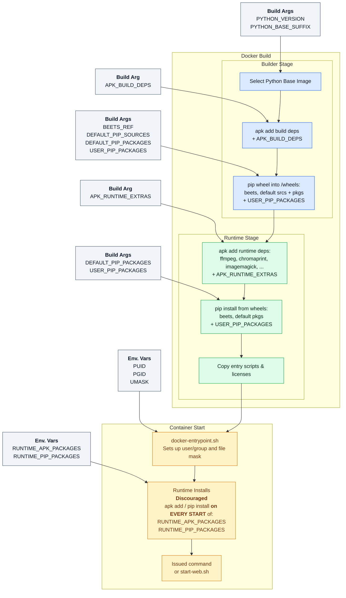

# docker-beets

Packages the upstream [`beetbox/beets`](https://github.com/beetbox/beets)
music manager on a Alpine base, optional build extras, and an entrypoint that
handles UID/GID mapping at runtime.

## Available Images

- [GHCR](https://github.com/treyturner/docker-beets/pkgs/container/beets): `ghcr.io/treyturner/beets`
- [Docker Hub](https://hub.docker.com/r/treyturner/beets): `docker.io/treyturner/beets`

### Tag Strategy

- `vX.Y.Z` - manual builds that pin the upstream beets release tag (e.g. `v2.5.1`)
  - You want one of these. They're mutable, but always contain the specified version of beets.
  - Need a version not currently posted? Open an issue and I'd be happy to build and publish it.
- `latest` - the latest version of beets I manually promoted after deeming it stable (YMMV)
  - **Discouraged**, but provided for convenience if you don't require a specific version of beets
  - ⚠️ If you use this tag, pull, and recreate your container, you **WILL** eventually upgrade beets to a version that breaks one or more plugins and/or your config 😭
- `vX.Y.Z-dev` - latest dev image for beets X.Y.Z
  - Where builds of upstream refs are tested before being manually promoted to `vX.Y.Z`
  - Automatically built for the version of beets pinned in [`build-and-publish-dev.yaml`](.github/workflows/build-and-publish-dev.yaml) on merges to this repo's `main` branch
- `vX.Y.Z-dev-<run_id>.<attempt_id>` – build-specific dev images for traceability
  - For debugging only, ie. helping me understand an issue you've reported

## Bundled Packages

### Beets + plugins:

- The ubiquitous [`beets`](https://github.com/beetbox/beets)
- [Samik081](https://github.com/Samik081)'s [`beatport4`](https://github.com/Samik081/beets-beatport4)
- [gtronset](https://github.com/gtronset)'s [`filetote`](https://github.com/gtronset/beets-filetote)
  - Only for beets `v2.3.x` [at the moment](https://github.com/gtronset/beets-filetote/issues/211)
- [edgars-supe](https://github.com/gtronset)'s [`importreplace`](https://github.com/edgars-supe/beets-importreplace)

### Python packages:

- [`requests`](https://requests.readthedocs.io/en/latest/) (for [`lyrics`](https://beets.readthedocs.io/en/latest/plugins/lyrics.html), [`fetchart`](https://beets.readthedocs.io/en/latest/plugins/fetchart.html), ...)
- [`requests_oauthlib`](https://requests-oauthlib.readthedocs.io/en/latest/) (for [`beatport4`](https://github.com/Samik081/beets-beatport4))
- [`beautifulsoup4`](https://beautiful-soup-4.readthedocs.io/en/latest/) (for [`lyrics`](https://beets.readthedocs.io/en/latest/plugins/lyrics.html))
- [`pyacoustid`](https://github.com/beetbox/pyacoustid) (for [`chroma`](https://beets.readthedocs.io/en/latest/plugins/chroma.html))
- [`pylast`](https://github.com/pylast/pylast) (for [`lastgenre`](https://beets.readthedocs.io/en/latest/plugins/lastgenre.html))
- [`python3-discogs-client`](https://github.com/joalla/discogs_client) (for [`discogs`](https://beets.readthedocs.io/en/stable/plugins/discogs.html))
- [`langdetect`](https://github.com/fedelopez77/langdetect) (for [`lyrics`](https://beets.readthedocs.io/en/latest/plugins/lyrics.html))
- [`flask`](https://flask.palletsprojects.com/en/stable/) (for [`web`](https://beets.readthedocs.io/en/latest/plugins/web.html))
- [`Pillow`](https://github.com/python-pillow/Pillow) (for [`fetchart`](https://beets.readthedocs.io/en/latest/plugins/fetchart.html), [`embedart`](https://beets.readthedocs.io/en/latest/plugins/embedart.html), ...)

### Runtime tools

- [`ffmpeg`](https://github.com/FFmpeg/FFmpeg)
- [`chromaprint`](https://github.com/acoustid/chromaprint) (provides `fpcalc` to [`chroma`](https://beets.readthedocs.io/en/latest/plugins/chroma.html))
- [`imagemagick`](https://github.com/ImageMagick/ImageMagick)
- [`jq`](https://github.com/jqlang/jq)
- [`yq`](https://github.com/mikefarah/yq)

## Usage

### Environment variables

|        Variable        |                                                      Description                                                       |  Default  |
| :--------------------: | :--------------------------------------------------------------------------------------------------------------------: | :-------: |
|         `PUID`         |                                      Numeric user ID that the entrypoint creates                                       |   `99`    |
|         `PGID`         |                                      Numeric group ID that the entrypoint creates                                      |   `100`   |
|        `UMASK`         |                                           Mask applied before spawning beets                                           |  `0002`   |
|       `BEETSDIR`       |                                                Path to the beets config                                                | `/config` |
| `RUNTIME_APK_PACKAGES` | Space-separated list of Alpine packages<br>to install at runtime ([note!](#installing-additional-packages-at-runtime)) | _(none)_  |
| `RUNTIME_PIP_PACKAGES` | Space-separated list of Python packages<br>to install at runtime ([note!](#installing-additional-packages-at-runtime)) | _(none)_  |

### Bind mounts

| Container Path |                             Description                             |
| :------------: | :-----------------------------------------------------------------: |
|   `/config`    |  Beets configuration (`config.yaml`), state, and plugin artifacts   |
|   _(custom)_   | Library mount(s) of your choice, e.g. `-v /mnt/user/music:/library` |

### Running one-off commands

The container is suited for one-off commands; simply put it after the image name:

```bash
$ docker run --rm \
  -v "$(pwd)/config:/config" \
  -v "$(pwd)/library:/library" \
  ghcr.io/treyturner/beets:v2.5.1 \
  beet --version

beets version 2.5.1
```

### Interactive shell

The image ships with `bash` if you prefer to work with an interactive shell inside the container:

```bash
$ docker run --rm -it \
  -v "$(pwd)/config:/config" \
  -v "$(pwd)/library:/library" \
  ghcr.io/treyturner/beets:v2.5.1 \
  bash

b8afc450904c:/config$ beet --version
beets version 2.5.1
```

### Persisting a container

The default command launches the [`web` plugin](https://beets.readthedocs.io/en/stable/plugins/web.html)'s HTTP server. If no config exists, the entrypoint creates one with `web.host: 0.0.0.0` (required to reach the web UI from outside the container); otherwise it will **MODIFY** your config before starting the server by enabling the `web` plugin and ensuring the host binding is present.

```bash
$ docker run -d --rm --name beets \
  -p 8337:8337 \
  -v "$(pwd)/config:/config" \
  -v "$(pwd)/library:/library" \
  ghcr.io/treyturner/beets:v2.5.1

$ docker logs beets
 * Serving Flask app 'beetsplug.web'
 * Debug mode: off
WARNING: This is a development server. Do not use it in a production deployment. Use a production WSGI server instead.
 * Running on http://127.0.0.1:8337
Press CTRL+C to quit
```

Once started, you can access the UI at `http://ip.of.docker.host:8337`, or start a shell via:

```
$ docker exec -it beets bash
2edbccf027b4:/config# beet --version
beets version 2.5.1
```

### Installing additional packages at runtime

**⚠️ Note:** Runtime package installation happens during **every container start**, adding several seconds or more to startup time and requiring network access. For packages you always need, consider creating a custom image using the build-time `APK_RUNTIME_EXTRAS` and `USER_PIP_PACKAGES` build arguments instead.

You can install additional Alpine (apk) or Python (pip) packages at container startup using the `RUNTIME_APK_PACKAGES` and `RUNTIME_PIP_PACKAGES` environment variables. This is useful for adding dependencies needed by specific plugins or custom workflows without rebuilding the image.


```bash
# Install some additional packages before starting
$ docker run -d --name beets \
  -e RUNTIME_APK_PACKAGES="curl" \
  -e RUNTIME_PIP_PACKAGES="beets-alternatives" \
  -p 8337:8337 \
  -v "$(pwd)/config:/config" \
  -v "$(pwd)/library:/library" \
  ghcr.io/treyturner/beets:v2.5.1
```

### Database trouble?

You can add `sqlite` to the container to debug or resolve problems with the beets database.

```bash
# If container isn't running...
docker run -it --rm -w /config -e RUNTIME_APK_PACKAGES="sqlite" ghcr.io/treyturner/beets:v2.5.1 sqlite3 library.db

# With container running...
docker exec -it -w /config beets bash -c 'apk add --no-cache sqlite && sqlite3 library.db'
```

## Configuration

Beets is extremely configurable; you'll want to read the [usage](https://beets.readthedocs.io/en/stable/reference/cli.html) and [configuration](https://beets.readthedocs.io/en/stable/reference/config.html) docs on how to create a `config.yaml` to put in `/config` and run the CLI to manage your library.

Make sure to set the `directory` setting in your config (e.g. `/library`) to match whatever mount you provide.

## Building Locally

```bash
docker build \
  --build-arg BEETS_REF=master \
  -t treyturner/beets:local-dev \
  .
```

### Supported build args

| Build Arg                | Description                                                                                                                        |
|--------------------------|------------------------------------------------------------------------------------------------------------------------------------|
| `PYTHON_VERSION`         | Python version to use, e.g. `3.12`                                                                                                |
| `PYTHON_BASE_SUFFIX`     | Python base image suffix, e.g. `alpine`                                                                                            |
| `BEETS_REF`              | The git ref of [`beetbox/beets`](https://github.com/beetbox/beets) to build (tag, branch, or SHA)                                 |
| `APK_BUILD_DEPS`         | Space-separated list of Alpine packages to install at build time                                                                   |
| `APK_RUNTIME_EXTRAS`     | Space-separated list of Alpine packages to include in the final image                                                             |
| `USER_PIP_PACKAGES`      | Space-separated list of user Python packages (wheels). Must already exist on PyPI or a compatible index so they can be wheeled offline. |

### Container Lifecycle Overview

Where each build argument and environment variable applies during the image build and container startup sequence.



## Contributing

I made this because I needed it. Issue reports, PRs, suggestions and questions are welcome and appreciated, or feel free to fork and make it more your own.

## License

Build scripts/logic licensed via [The Unlicense](LICENSE).

Bundled software includes additional licenses:
- [`beets`](https://github.com/beetbox/beets) (MIT) — copy available in the image at `/usr/share/licenses/beets/LICENSE`.
- Alpine packages such as `ffmpeg`, `chromaprint`, and others ship their respective licenses in `/usr/share/licenses/`.

Review those notices to ensure your downstream use complies, especially with GPL/LGPL components like `ffmpeg`.
