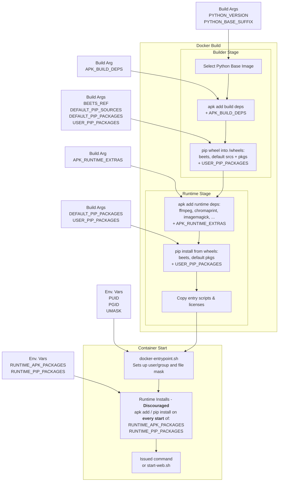

# Container Lifecycle Overview

This diagram highlights when each build argument or runtime environment variable influences dependency installation during the image build and container startup sequence.

### Source

